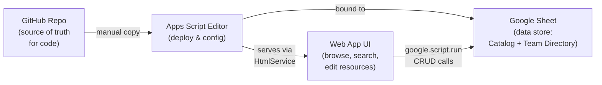

# Resource Catalog

A browsable resource catalog and team directory built as a Google Apps Script web app backed by Google Sheets.

## Features

- **Browse**: Card grid with search and multi-dimensional filtering (Function Area, Component, Status, Type)
- **Edit**: Click any card to edit via modal form; add new resources via "+ Add Resource"
- **Team Directory**: Tabbed view of triads, guilds, meetings, channels, and mailing lists with inline editing
- **Component validation**: Component dropdown populated from the Triad Map; cards flagged when components don't match
- **Branded UI**: Dark chrome header with light content areas

## Setup

### 1. Create the Google Sheet

Create a new Google Sheet with these tabs. Add column headers in row 1 of each tab:

**Catalog** tab:
`Title`, `Resource Type`, `Function Area`, `Component`, `System of Record`, `Link`, `Owner/DRI`, `Status`, `Last Reviewed`, `Review Cadence`, `Short Summary`

**Triad Map** tab: `#`, `PM`, `Eng Manager`, `Architect`, `Components` (comma-separated component names)

**Guilds** tab: `Guild`, `Lead`, `Channel`

**Key Meetings** tab: `Day`, `Meeting`, `Time`

**Slack Channels** tab: `Channel`, `Purpose`

**Slack Groups** tab: `Group`, `Scope`

**Mailing Lists** tab: `List`, `Purpose`

### 2. Create the Apps Script project

1. In your Google Sheet, go to **Extensions > Apps Script**
2. Delete the default `Code.gs` content and replace with the contents of `apps-script/Code.gs`
3. Create additional files (click **+** next to Files):
   - **Script files** (+ > Script): `SheetService` — paste contents of `apps-script/SheetService.gs`
   - **HTML files** (+ > HTML): Create each of these and paste the corresponding file contents:
     - `Index` (from `apps-script/Index.html`)
     - `CatalogBrowse` (from `apps-script/CatalogBrowse.html`)
     - `CatalogForm` (from `apps-script/CatalogForm.html`)
     - `TeamDirectory` (from `apps-script/TeamDirectory.html`)
     - `Script` (from `apps-script/Script.html`)
     - `Styles` (from `apps-script/Styles.html`)
4. In `SheetService.gs`, replace `YOUR_GOOGLE_SHEET_ID_HERE` with your Sheet ID (found in the Sheet URL: `https://docs.google.com/spreadsheets/d/SHEET_ID_HERE/edit`)

### 3. Deploy

1. Click **Deploy > New deployment**
2. Select type: **Web app**
3. Configure:
   - Execute as: **Me**
   - Who has access: **Anyone within [your org]**
4. Click **Deploy**
5. Share the web app URL with your team

### 4. Updating after code changes

1. Edit the files in the Apps Script editor (or copy updated files from this repo)
2. Click **Deploy > Manage deployments**
3. Click the **Edit** (pencil) icon on your deployment
4. Select **New version**
5. Click **Deploy**
6. Hard refresh the web app (Ctrl+Shift+R / Cmd+Shift+R)

## Architecture



## File Structure

```
apps-script/
  Code.gs              # Entry point: doGet(), include() helper
  SheetService.gs      # Generic CRUD for any Sheet tab
  Index.html           # App shell: header, nav, modal containers
  CatalogBrowse.html   # Filter bar + card grid
  CatalogForm.html     # Add/edit modal form
  TeamDirectory.html   # Tabbed team directory tables
  Script.html          # Client-side JavaScript
  Styles.html          # CSS styles
  appsscript.json      # Apps Script manifest
```

## Data notes

- Multi-value fields use semicolons as separators in the Catalog (Function Area, Component) and commas in the Triad Map (Components)
- The Triad Map "Components" column is the source of truth for valid component names
- The app reads column headers dynamically from row 1 of each tab
